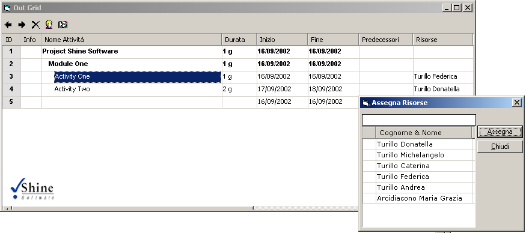



## Shine Software Project 2002

### Description

Microsoft Project 2000 Simulation
 
### More Info
 
The project is only at the start but is a good start! If U want help me send me an e-mail to info@shinesoftware.it

             |
---                |---
**Submitted On**   |2002-08-06 18:30:36
**By**             |[Michelangelo Turillo](https://github.com/Planet-Source-Code/PSCIndex/blob/master/ByAuthor/michelangelo-turillo.md)
**Level**          |Advanced
**User Rating**    |3.7 (11 globes from 3 users)
**Compatibility**  |VB 6\.0
**Category**       |[OLE/ COM/ DCOM/ Active\-X](https://github.com/Planet-Source-Code/PSCIndex/blob/master/ByCategory/ole-com-dcom-active-x__1-29.md)
**World**          |[Visual Basic](https://github.com/Planet-Source-Code/PSCIndex/blob/master/ByWorld/visual-basic.md)
**Archive File**   |[Shine\_Soft1317459162002\.zip](https://github.com/Planet-Source-Code/michelangelo-turillo-shine-software-project-2002__1-39045/archive/master.zip)

